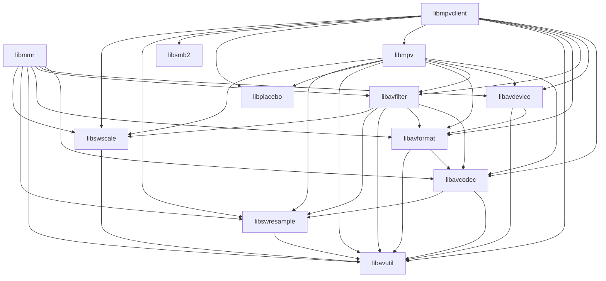

```mermaid
graph TD
  libavcodec --> libavutil
  libavcodec --> libswresample
  libavdevice --> libavformat
  libavdevice --> libavutil
  libavfilter --> libavcodec
  libavfilter --> libavformat
  libavfilter --> libavutil
  libavfilter --> libswresample
  libavfilter --> libswscale
  libavformat --> libavcodec
  libavformat --> libavutil
  libmmr --> libavcodec
  libmmr --> libavdevice
  libmmr --> libavfilter
  libmmr --> libavformat
  libmmr --> libavutil
  libmmr --> libswresample
  libmmr --> libswscale
  libmpv --> libavcodec
  libmpv --> libavdevice
  libmpv --> libavfilter
  libmpv --> libavformat
  libmpv --> libavutil
  libmpv --> libplacebo
  libmpv --> libswresample
  libmpv --> libswscale
  libmpvclient --> libavcodec
  libmpvclient --> libavdevice
  libmpvclient --> libavfilter
  libmpvclient --> libavformat
  libmpvclient --> libavutil
  libmpvclient --> libmpv
  libmpvclient --> libplacebo
  libmpvclient --> libsmb2
  libmpvclient --> libswresample
  libmpvclient --> libswscale
  libswresample --> libavutil
  libswscale --> libavutil
```
